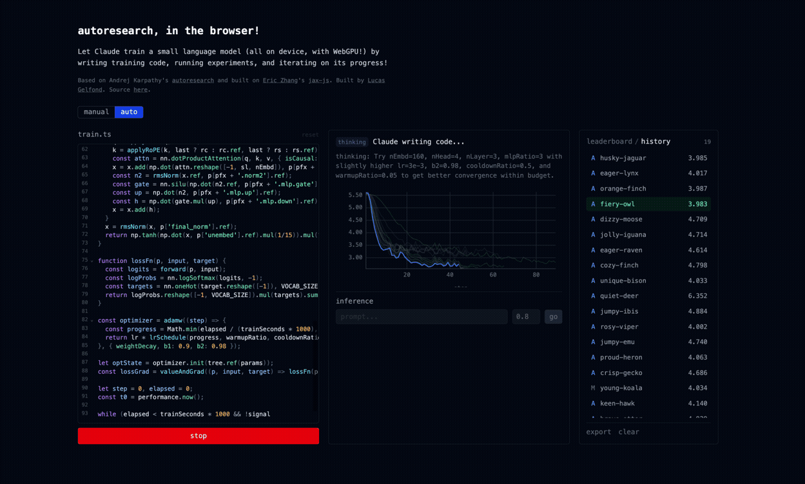

# autoresearch-webgpu

Browser port of [Karpathy's autoresearch](https://github.com/karpathy/autoresearch). We generate arbitrary typescript, for `train.ts` using a language model, which then creats the training loop. 

**[Try it live](https://autoresearch.lucasgelfond.online)**

## What it does

This playground trains small language models inside of your browser using generated code. The agent runs in a loop changing the code, running experiments in your browser, and then sending the results back to Claude to try more. 

Part of this process involves tuning "hyperparameters," model training settings. You can set these manually, or use Claude to set th

There's nothing crazy about this application otherwise; it is using Eric Zhang's excellent jax-js, which makes ML in the browser a breeze, is otherwise a basic SvelteKit app, using PGLite underneath the hood to keep track of experiment results. 

## License

MIT. See [LICENSE](LICENSE).
